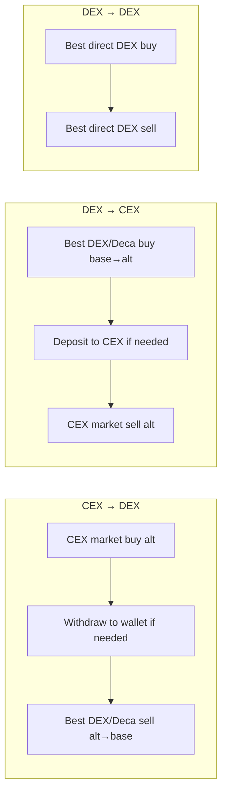
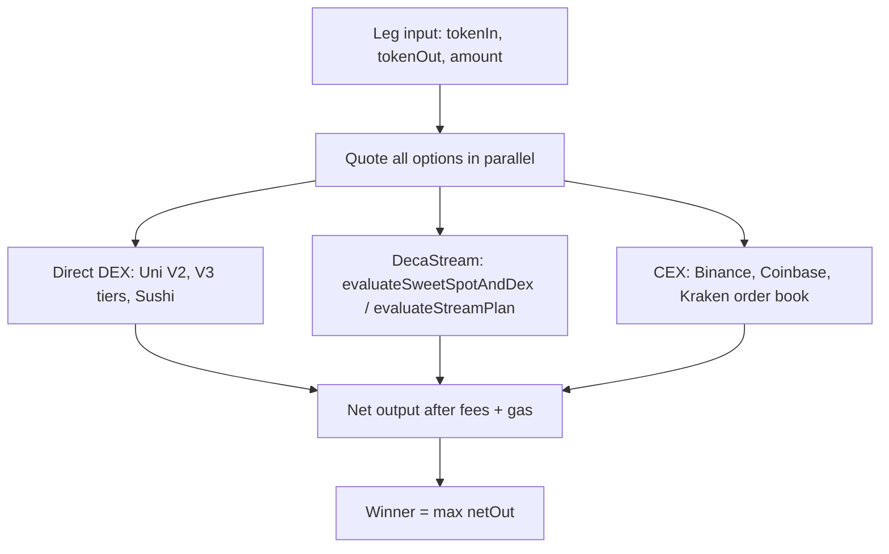

# Arb Bot — Design Specification

Cross-venue arbitrage bot: **CEX ↔ DEX ↔ DecaStream**, with best-execution routing and a fixed **10 bps net profit gate**.

---

## 1. Purpose

The arb-bot finds and executes trades where buying on one venue and selling on another yields **≥ 10 bps net profit** after:

- CEX taker fees, withdrawal/deposit fees
- DEX pool fees (Uniswap V2/V3 tiers, SushiSwap)
- Deca premium (**+40 bps** on top of underlying DEX fees, when Deca path is chosen)
- On-chain protocol/bot stream fees (when streamed via Core)
- Gas (all on-chain legs, priced at execution-time `gasPrice`)

It does **not** use CEX prices as a fair-value oracle. CEX APIs are **executable venues** — we can buy on Binance and sell on Uniswap, or the reverse.

Settlement of Deca `placeTrade` positions remains external (**local-monitor**), same as liquidity-bot.

---

## 2. Strategic difference from liquidity-bot

| Dimension | liquidity-bot | arb-bot |
|-----------|---------------|---------|
| Signal | DEX thin vs deep dislocation | Cross-venue price gap (CEX ↔ DEX) |
| CEX role | None | Executable venue via API |
| Goal | Liquidity throughput | Net profit ≥ 10 bps |
| Selection | Mid-range coupled spread band | Highest `netProfitBps` above gate |
| Deca usage | Leg 2 default (`placeTrade`) | Quoted and compared; use only if it wins |
| Profit gate | Spread-based (`minCoupledSpreadBps`) | **≥ 10 bps net after all fees** |

---

## 3. Executable paths

For each `(base, alt)` pair, evaluate all inventory-aligned paths:



| Path | Leg 1 | Leg 2 | v1 scope |
|------|-------|-------|----------|
| **CEX→DEX** | CEX market buy alt | Best sell alt→base (Deca or direct DEX) | Yes (inventory-aligned) |
| **DEX→CEX** | Best buy base→alt (Deca or direct DEX) | CEX market sell alt | Yes (inventory-aligned) |
| **DEX→DEX** | Best direct DEX buy | Best direct DEX sell | Yes (fallback) |

**v1 constraint:** only fire paths where inventory is already on the correct side (no synchronous withdraw/deposit in the same cycle). Async transfers are tracked but not initiated mid-opportunity.

---

## 4. Best-execution routing (per leg)

Every leg competes across venues. Never assume Deca.



### 4.1 Direct DEX

Single swap via router/quoter. Pool fee only:

| Venue | ID | Typical fee |
|-------|-----|-------------|
| Uniswap V2 | `uniswap-v2` | 30 bps |
| Uniswap V3 0.01% | `uniswap-v3-100` | 1 bps |
| Uniswap V3 0.05% | `uniswap-v3-500` | 5 bps |
| Uniswap V3 0.30% | `uniswap-v3-3000` | 30 bps |
| Uniswap V3 1.00% | `uniswap-v3-10000` | 100 bps |
| SushiSwap | `sushiswap` | 30 bps |

Gas: one `estimateGas(swap)` × current `gasPrice`, with buffer.

### 4.2 DecaStream path

Quote via on-chain StreamDaemon (finalists) or off-chain mirror (scan pass):

| Function | Use |
|----------|-----|
| `StreamDaemon.evaluateSweetSpotAndDex(tokenIn, tokenOut, volume, effectiveGas, usePriceBased)` | Preview: best DEX + sweetSpot |
| `StreamDaemon.evaluateStreamPlan(...)` | Full plan: sweetSpot, streamVolume, quotedOut |
| `calculateSweetSpotV2` (keeper mirror) | Fast scan; on-chain call for finalists |

**Deca cost model:**

```
decaPremiumBps = 40   // +0.4% on top of underlying DEX pool fee

// Per streamed chunk:
chunkOut = dexQuote(chunkIn)
chunkOut -= chunkOut × decaPremiumBps / 10_000
chunkOut -= protocolFee (10 bps) + botFee (10 bps) on output  // Core stream fees

// Gas (Deca path):
totalGas = placeTradeGas + (sweetSpot × executeTradesGas)
```

Deca is chosen only when `netOut_deca > netOut_directDex` after all costs.

### 4.3 CEX path

Market order at best bid/ask from order book:

```
buyCost  = ask × size × (1 + takerFeeBps/10_000) + withdrawFeeUsd
sellRecv = bid × size × (1 - takerFeeBps/10_000) - depositFeeUsd (if applicable)
```

No on-chain gas on the CEX leg itself.

---

## 5. Profit gate — 10 bps

The only hard execution threshold:

```
netProfitBps = (netBaseOut - baseIn) / baseIn × 10_000

Execute only if:  netProfitBps >= 10
```

Where `netBaseOut` is final base received after **all** fees and gas (converted to base equivalent).

- No USD floor (a $5 trade at 12 bps passes; a $500 trade at 8 bps does not).
- The 10 bps threshold is **fixed**; the feedback loop calibrates prediction accuracy, not the gate.

---

## 6. Venues

### 6.1 DEX — Ethereum mainnet (Phase 1)

Six venues, matching StreamDaemon v2.2.1 and liquidity-bot:

- Uniswap V2
- Uniswap V3 (100 / 500 / 3000 / 10000 fee tiers)
- SushiSwap

Balancer fetcher exists in deployment but is **not** in StreamDaemon's six-DEX list — excluded from v1.

### 6.2 DEX — Hyperliquid spot (Phase 2)

Hyperliquid is **not** an Ethereum mainnet DEX. It runs on Hyperliquid L1 (chain ID 999) with API-traded spot markets.

| Aspect | Detail |
|--------|--------|
| API | `https://api.hyperliquid.xyz/info` (market data), `/exchange` (orders) |
| Spot taker fee | ~5 bps (+ possible builder fee) |
| Asset notation | `@index` (e.g. `@107`) |
| Mainnet mapping | Wrapped equivalents (UBTC ↔ WBTC, etc.) |

Treat Hyperliquid as a **CEX-like venue** in routing. Cross-venue arb with mainnet Uniswap requires bridge transfer (latency + cost). Phase 2 only, with explicit bridge modeling and pre-positioned inventory.

### 6.3 CEX — Phase 1

| Exchange | Market data (public) | Trading API | Typical taker fee |
|----------|---------------------|-------------|-------------------|
| **Binance** | `GET /api/v3/ticker/bookTicker` | `POST /api/v3/order` | 10 bps (tiered) |
| **Coinbase Advanced Trade** | `GET /api/v3/brokerage/best_bid_ask` | `POST /api/v3/brokerage/orders` | 40–60 bps (tiered) |
| **Kraken** | `GET /0/public/Ticker` | `POST /0/private/AddOrder` | 26 bps (tiered) |

All require API key + secret for order placement. Market data endpoints are public.

### 6.4 CEX — Phase 2 additions

OKX, Bybit, KuCoin, Gate.io, Bitget — add for alt coverage gaps.

---

## 7. Scan and evaluation flow

Each cycle:

```
1. Poll CEX order books (Binance, Coinbase, Kraken) for mapped alts
2. Quote all 6 mainnet DEX venues (buy + sell directions)
3. For finalists: eth_call StreamDaemon.evaluateSweetSpotAndDex / evaluateStreamPlan
4. For each (base, alt) × direction × path:
     leg1 = bestExecution(buy side)
     leg2 = bestExecution(sell side)
     netProfitBps = round-trip after all fees + gas
5. Filter: netProfitBps >= 10, inventory available, no in-flight transfer, CEX quote fresh
6. Pick highest netProfitBps (confidence-adjusted after calibration data exists)
7. Finalist refresh: re-quote top 3 with fresh prices + gas
8. Execute winning composition
9. Record predicted vs actual → append to feedback batch
10. Every 10 completed trades: run calibration
```

**Staleness guards:**

- CEX quote age > `maxCexStalenessMs` (default 5s) → reject
- DEX quotes refreshed for finalists before execution

---

## 8. Inventory model

Dual inventory across venues:

| Venue | Holds | Enables |
|-------|-------|---------|
| CEX accounts | USDT/USDC + alts | CEX→DEX (buy alt), receive from DEX→CEX |
| On-chain wallet | WETH/USDC/USDT/DAI/WBTC + alts | DEX→CEX (buy alt), receive from CEX→DEX |

**v1:** only execute when required inventory is already on the correct side.

**TransferTracker (Phase 2):** monitor in-flight CEX withdrawals/deposits; enable async cross-venue paths once bridge costs are modeled.

Base tokens (same as liquidity-bot): `WETH`, `USDC`, `USDT`, `DAI`, `WBTC`.

Pair universe: repo `config/*_pairs_clean.json` via `REPO_ROOT`.

---

## 9. Feedback loop — learn every 10 trades

### 9.1 Data model

```typescript
// bots/<id>.prediction-feedback.json
interface PredictionFeedback {
  version: 1;
  coefficients: {
    gasMultiplier: number;          // starts 1.25
    slippageBufferBps: number;      // starts 15
    sweetSpotBias: number;          // starts 0
    decaPremiumCorrection: number;  // starts 1.0 (scales 40 bps)
    cexFillSlippageBps: number;     // starts 5
  };
  batches: FeedbackBatch[];         // rolling window, last 30 batches (300 trades)
}

interface TradeOutcome {
  tradeId: string;
  path: 'cex-dex' | 'dex-cex' | 'dex-dex';
  leg1Venue: string;                // e.g. 'binance', 'uniswap-v3-500', 'deca'
  leg2Venue: string;
  predicted: {
    netProfitBps: number;
    gasUsd: number;
    sweetSpot: number;
    gasPriceGwei: number;
    decaUsed: boolean;
  };
  actual: {
    netProfitBps: number;
    gasUsd: number;
    sweetSpot: number;
    cexFillPrice?: number;
    gasPriceGwei: number;
  };
}
```

### 9.2 Calibration (v0 — bounded step updates)

After each batch of 10 completed trades:

- Compute MAE and bias for profit, gas, sweetSpot
- Adjust coefficients by bounded steps (max ±5% per batch):
  - `gasMultiplier` — if gas consistently underestimated
  - `slippageBufferBps` — if profit consistently overestimated
  - `sweetSpotBias` — if stream count prediction drifts
  - `decaPremiumCorrection` — if Deca path profit diverges from 40 bps model
  - `cexFillSlippageBps` — if CEX fills worse than quoted bid/ask

Telegram alert per batch: *"Batch 3: MAE 8.2 bps → 5.1 bps, gasMult 1.25 → 1.18"*.

### 9.3 Dataset progression

| Trades | State |
|--------|-------|
| 0–9 | v0 static algorithm; collect outcomes, no calibration |
| 10 | First calibration (batch 1) |
| 20–290 | Refining coefficients |
| 300+ | Rolling 30-batch window |

---

## 10. Execution flow

```
Winning path selected (netProfitBps >= 10):

  CEX→DEX:
    1. CEX market buy alt (CexExecutor)
    2. If alt not on-chain: wait for withdrawal (Phase 2) or skip (v1: pre-positioned)
    3. On-chain sell alt→base via winning DEX/Deca leg

  DEX→CEX:
    1. On-chain buy base→alt via winning DEX/Deca leg
    2. If alt not on CEX: deposit (Phase 2) or skip (v1: pre-positioned)
    3. CEX market sell alt

  DEX→DEX:
    1. Direct swap leg 1
    2. Direct swap leg 2 (or placeTrade if Deca wins leg 2)
```

Record full `ProfitEstimate` snapshot to `trade-ledger.jsonl`. `CompletionWatcher` fills actuals on settlement.

---

## 11. Configuration schema (draft)

```typescript
// bots/<id>.json
{
  "id": "arb-alpha",
  "enabled": false,
  "baseTokens": ["WETH", "USDC"],
  "scan": {
    "intervalMs": 15000,
    "minNetProfitBps": 10,
    "maxCexStalenessMs": 5000,
    "finalistCount": 3
  },
  "trade": {
    "nominalTradeUsd": 50,
    "balanceUsagePct": 80,
    "maxOpenTrades": 2,
    "cooldownMs": 300000
  },
  "feeds": {
    "cexSources": ["binance", "coinbase", "kraken"],
    "pollIntervalMs": 1000
  },
  "evaluation": {
    "decaPremiumBps": 40,
    "protocolFeeBps": 10,
    "botFeeBps": 10,
    "gasBufferPct": 25,
    "feedbackBatchSize": 10
  },
  "gas": {
    "minEthWei": "...",
    "targetEthWei": "..."
  },
  "contracts": {
    "core": "0xD0B6DaD2Dc5dad47bEB7C3D7Dd7980a20CD6a710",
    "streamDaemon": "0xfc61Dd8254F07b515b0529032181DA1cC42518c1",
    "deploymentManifest": "../../versions/deployment-addresses-mainnet-2.2.1.json"
  }
}
```

### Environment variables (draft)

| Variable | Required | Notes |
|----------|----------|--------|
| `MAINNET_RPC_URL` | Yes | Ethereum mainnet HTTP RPC |
| `BOT_<ID>_KEY` | Yes | On-chain wallet private key |
| `DRY_RUN` | Yes | `1` = no txs/orders, `0` = live |
| `BINANCE_API_KEY` / `BINANCE_API_SECRET` | For CEX trading | |
| `COINBASE_API_KEY` / `COINBASE_API_SECRET` | For CEX trading | |
| `KRAKEN_API_KEY` / `KRAKEN_API_SECRET` | For CEX trading | |
| `ETH_USD`, `BTC_USD` | Recommended | Sizing hints |
| `REPO_ROOT` | Optional | Monorepo root for pair manifests |
| `TELEGRAM_*` | Optional | Alerts |

---

## 12. Package layout (target)

```
arb-bot/
├── src/
│   ├── index.ts                         # PM2 entry (BOT_ID)
│   ├── runner/ArbBotRunner.ts
│   ├── feeds/
│   │   ├── CexMarketData.ts             # bid/ask, depth, staleness
│   │   ├── symbolMap.ts                 # alt address → CEX pair
│   │   └── types.ts
│   ├── evaluation/
│   │   ├── BestExecutionRouter.ts       # per-leg venue competition
│   │   ├── DecaQuoteService.ts          # StreamDaemon eth_call + 40bps
│   │   ├── DexQuoteService.ts           # port from liquidity-bot
│   │   ├── SweetSpotPredictor.ts        # calculateSweetSpotV2 mirror
│   │   ├── GasCostEstimator.ts
│   │   ├── CrossVenueEstimator.ts       # full path profit in bps
│   │   └── feedback/
│   │       ├── FeedbackStore.ts
│   │       └── BatchCalibrator.ts
│   ├── execution/
│   │   ├── CexExecutor.ts               # place order, balances
│   │   ├── OnChainExecutor.ts           # directSwap + placeTrade
│   │   ├── TransferTracker.ts           # Phase 2
│   │   └── ArbOrchestrator.ts
│   ├── inventory/InventoryManager.ts
│   ├── selection/ProfitSelector.ts
│   ├── scan/ArbScanner.ts
│   ├── notify/                           # port from liquidity-bot
│   ├── config/
│   └── chain/
├── bots/<id>.json
├── bots/<id>.prediction-feedback.json
├── bots/<id>.trade-ledger.jsonl
├── tests/
├── ecosystem.config.cjs
├── package.json
└── tsconfig.json
```

---

## 13. Example dry-run output

```
arb-bot scan:dry-run --bot arb-alpha

Pair       Path      Leg1              Leg2               Net bps  Gate
LINK/WETH  CEX→DEX   Binance buy       Uni-V3-500 sell    +14      ★
LINK/WETH  CEX→DEX   Binance buy       Deca stream        +11
LINK/WETH  DEX→CEX   Sushi buy         Kraken sell         +8      —
UNI/USDC   DEX→DEX   Uni-V2 buy        Uni-V3-3000 sell   +12      ★

Gate: 10 bps | Deca rejected on LINK/WETH (direct +14 > deca +11)
Feedback: batch 2 | gasMult=1.18 | 20 trades calibrated
```

---

## 14. Risks and mitigations

| Risk | Mitigation |
|------|------------|
| CEX fill worse than quoted bid/ask | `cexFillSlippageBps` in feedback; IOC/limit-with-offset orders |
| CEX ↔ on-chain transfer latency | v1: inventory-aligned only; Phase 2: TransferTracker |
| Deca 40 bps model drift | `decaPremiumCorrection` coefficient; on-chain quote for finalists |
| Gas spike between eval and execution | Store gas at both times; `gasMultiplier` learns |
| SweetSpot prediction drift | On-chain `evaluateStreamPlan` for finalists; `sweetSpotBias` calibration |
| Overfitting on 10-sample batches | Bounded coefficient updates; 30-batch rolling window |
| MEV on on-chain legs | Slippage buffers; private mempool in Phase 3 |
| Hyperliquid bridge cost/latency | Phase 2 only; explicit bridge fee in model |

---

## 15. Related docs

- `liquidity-bot/README.md` — reference bot patterns
- `liquidity-bot/ARCHITECTURE.md` — scan/execute/notify architecture
- `docs/LIQUIDITY_BOT_DESIGN.md` — liquidity-bot strategy
- `src/StreamDaemon.sol` — on-chain quote and sweetSpot functions
- `keeper/src/functions/slippage-calculations.ts` — off-chain DECA vs NODECA mirror
