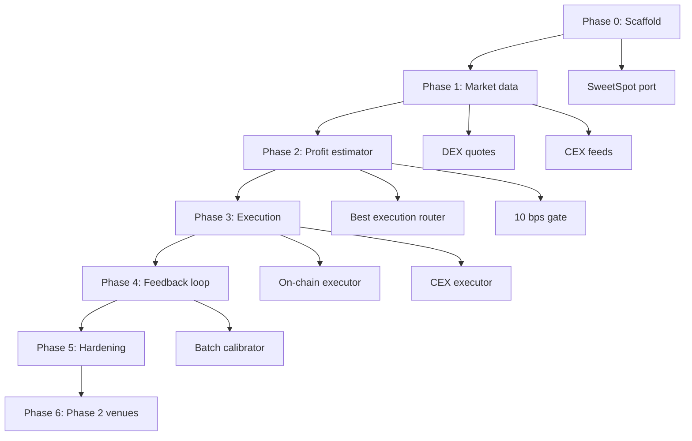

# Arb Bot — Implementation Plan

Phased build plan with milestones and checklists. **No coding until Phase 0 checklist is agreed.**

Reference: [DESIGN.md](./DESIGN.md)

---

## Overview

| Phase | Name | Duration (est.) | Deliverable |
|-------|------|-----------------|-------------|
| 0 | Scaffold & shared foundations | 2–3 days | Package builds, config loads, sweetSpot port |
| 1 | Market data & quoting | 3–4 days | CEX + DEX quotes in dry-run matrix |
| 2 | Profit estimator & best execution | 4–5 days | 10 bps gate, Deca vs DEX vs CEX comparison |
| 3 | Execution & orchestration | 4–5 days | Live two-leg cross-venue execution (DRY_RUN first) |
| 4 | Feedback loop | 2–3 days | 10-trade batches, coefficient calibration |
| 5 | Hardening & ops | 3–4 days | PM2, notify, integration tests, docs |
| 6 | Phase 2 venues | TBD | Hyperliquid, OKX/Bybit, async transfers |

**Total to v1 live (Phases 0–5):** ~18–24 days focused work.

---

## Phase 0 — Scaffold & shared foundations

**Goal:** Empty package that builds, loads config, and ports sweetSpot logic. No trading.

### Milestone 0.1 — Package skeleton

- [ ] `package.json` with ethers, zod, dotenv, tsx, vitest, typescript
- [ ] `tsconfig.json`, `vitest.config.ts` (mirror liquidity-bot)
- [ ] `src/index.ts` PM2 entry stub
- [ ] `.env.example` with all required vars documented
- [ ] `ecosystem.config.cjs` PM2 multi-bot config
- [ ] `npm run build` succeeds

### Milestone 0.2 — Config & bot lifecycle

- [ ] Zod schema for `bots/<id>.json` (see DESIGN.md §11)
- [ ] `loadBot.ts`, `loadPairs.ts` (port/adapt from liquidity-bot)
- [ ] `baseTokens.ts` — reuse WETH/USDC/USDT/DAI/WBTC definitions
- [ ] CLI: `generate bot -- <id>` (wallet + config template)
- [ ] CLI: `scan:dry-run -- bot <id>` stub (prints "not implemented")
- [ ] Unit tests: config validation, pair loading

### Milestone 0.3 — Chain & contract bindings

- [ ] `chain/provider.ts`, `chain/wallet.ts`
- [ ] `chain/contracts.ts` — Core, StreamDaemon, routers, quoters (port from liquidity-bot)
- [ ] Load deployment manifest from `versions/deployment-addresses-mainnet-2.2.1.json`
- [ ] Integration test: provider connects, StreamDaemon address resolves

### Milestone 0.4 — SweetSpot predictor

- [ ] Port `calculateSweetSpotV2` → `evaluation/SweetSpotPredictor.ts`
- [ ] Unit tests against known inputs (match keeper test vectors)
- [ ] Document DEFAULT=4, MAX=500, 10 bps slippage target

**Phase 0 exit criteria:**
- `npm run build && npm test` green
- `npm run generate bot -- arb-alpha` creates config + wallet
- SweetSpot tests pass

---

## Phase 1 — Market data & quoting

**Goal:** Poll CEX order books and DEX quotes; print opportunity matrix in dry-run (no profit model yet).

### Milestone 1.1 — DEX quote service

- [ ] Port `DexQuoteService.ts` from liquidity-bot (6 venues)
- [ ] Port `STREAM_DEX_IDS`, quote types
- [ ] Quote buy and sell for `(tokenIn, tokenOut, amountIn)`
- [ ] Unit tests with mocked provider responses
- [ ] Integration test: live mainnet quote for WETH→LINK (optional, gated on RPC)

### Milestone 1.2 — CEX market data

- [ ] `feeds/CexMarketData.ts` — REST client abstraction
- [ ] Binance: `GET /api/v3/ticker/bookTicker` + `GET /api/v3/depth`
- [ ] Coinbase: `GET /api/v3/brokerage/best_bid_ask`
- [ ] Kraken: `GET /0/public/Ticker`
- [ ] `feeds/symbolMap.ts` — map alt token symbols → CEX pair IDs per exchange
- [ ] Staleness tracking (`fetchedAt`, `maxCexStalenessMs`)
- [ ] Rate limiting and error handling per exchange
- [ ] Unit tests with mocked HTTP responses

### Milestone 1.3 — Symbol mapping & pair coverage

- [ ] Build CEX pair list from `config/*_pairs_clean.json`
- [ ] Skip alts with no CEX listing on any Phase 1 exchange
- [ ] Handle WETH↔ETH, WBTC↔BTC symbol aliases
- [ ] Report coverage stats (% of pair universe quotable on CEX)

### Milestone 1.4 — Scan dry-run (quotes only)

- [ ] `scan/ArbScanner.ts` — iterate base×alt pairs, fetch CEX + DEX quotes
- [ ] CLI: `scan:dry-run -- bot <id>` prints raw quote matrix
- [ ] Output columns: pair, direction, CEX bid/ask, best DEX buy/sell, dislocation bps (informational)
- [ ] `scan:pair-matrices` CLI (optional, mirror liquidity-bot)

**Phase 1 exit criteria:**
- Dry-run completes for configured bot against mainnet RPC + live CEX APIs
- Coverage report shows quotable pairs per exchange
- No execution, no profit gate yet

---

## Phase 2 — Profit estimator & best execution

**Goal:** Full profit model with 10 bps gate; Deca quoted and compared against direct DEX and CEX.

### Milestone 2.1 — Gas cost estimator

- [ ] `evaluation/GasCostEstimator.ts`
- [ ] `estimateGas(directSwap)` with 20% buffer
- [ ] `estimateGas(placeTrade)` with 20% buffer
- [ ] `estimateGas(executeTrades)` with 50% buffer, 800k floor (local-monitor pattern)
- [ ] `provider.getFeeData()` → gasPrice at eval time
- [ ] Convert gas wei → base token USD equivalent
- [ ] Unit tests with mocked gas estimates

### Milestone 2.2 — Deca quote service

- [ ] `evaluation/DecaQuoteService.ts`
- [ ] Off-chain: sweetSpot + per-chunk DEX quotes + 40 bps deca premium + protocol/bot fees
- [ ] On-chain (finalists): `eth_call StreamDaemon.evaluateSweetSpotAndDex`
- [ ] On-chain (finalists): `eth_call StreamDaemon.evaluateStreamPlan` for full stream simulation
- [ ] Compare off-chain vs on-chain for same inputs (integration test)
- [ ] Return `{ netOut, sweetSpot, gasCost, dexUsed, decaPremiumPaid }`

### Milestone 2.3 — Best execution router

- [ ] `evaluation/BestExecutionRouter.ts`
- [ ] For a leg `(tokenIn, tokenOut, amountIn)`:
  - [ ] Quote all 6 direct DEX venues
  - [ ] Quote Deca path via DecaQuoteService
  - [ ] Quote CEX path (if applicable leg)
  - [ ] Return winner: `{ venue, netOut, fees, gas, path: 'direct' | 'deca' | 'cex' }`
- [ ] Unit tests: Deca loses to direct DEX when 40 bps makes it worse
- [ ] Unit tests: CEX wins when spread exceeds DEX + fees

### Milestone 2.4 — Cross-venue estimator

- [ ] `evaluation/CrossVenueEstimator.ts`
- [ ] Compose leg1 + leg2 best executions for each path:
  - [ ] CEX→DEX
  - [ ] DEX→CEX
  - [ ] DEX→DEX
- [ ] Compute `netProfitBps = (netBaseOut - baseIn) / baseIn × 10_000`
- [ ] Include CEX taker fees, withdrawal fees (configurable per exchange)
- [ ] Gate: `netProfitBps >= minNetProfitBps` (default 10)

### Milestone 2.5 — Profit selector & dry-run profit table

- [ ] `selection/ProfitSelector.ts` — pick highest netProfitBps above gate
- [ ] Cooldown + repeat guard (port from liquidity-bot)
- [ ] Finalist refresh: re-quote top 3 before selection
- [ ] CLI: `scan:dry-run` upgraded to show profit table with leg winners
- [ ] CLI: `scan:profit-report` — summary stats across all pairs

**Phase 2 exit criteria:**
- Dry-run prints profit table with Deca vs direct vs CEX leg winners
- Gate correctly rejects opportunities below 10 bps
- Deca only selected when it beats alternatives after 40 bps

---

## Phase 3 — Execution & orchestration

**Goal:** Execute winning paths on-chain and via CEX API. DRY_RUN first, then live.

### Milestone 3.1 — On-chain executor

- [ ] Port `directSwap.ts` from liquidity-bot
- [ ] Port `placeTradeOnCore.ts` from liquidity-bot
- [ ] `execution/OnChainExecutor.ts` — dispatch to direct swap or placeTrade based on BestExecutionRouter winner
- [ ] Fresh re-quote before execution with slippage buffer
- [ ] DRY_RUN mode: log intent, no tx submission
- [ ] Integration tests: directSwap + placeTrade on fork/anvil (optional)

### Milestone 3.2 — CEX executor

- [ ] `execution/CexExecutor.ts` — authenticated trading client
- [ ] Binance: market buy/sell via `POST /api/v3/order`
- [ ] Coinbase: market order via Advanced Trade API
- [ ] Kraken: market order via `AddOrder`
- [ ] Balance queries per exchange
- [ ] Order status polling
- [ ] DRY_RUN mode: log intended order, no submission
- [ ] Sandbox/testnet support for Binance (`testnet.binance.vision`)

### Milestone 3.3 — Inventory manager

- [ ] `inventory/InventoryManager.ts`
- [ ] Query on-chain wallet balances (base + alts)
- [ ] Query CEX balances via API
- [ ] Path eligibility: only offer paths where inventory is on correct side (v1)
- [ ] Report inventory snapshot in dry-run

### Milestone 3.4 — Arb orchestrator

- [ ] `execution/ArbOrchestrator.ts` — coordinate multi-leg execution
- [ ] CEX→DEX: CEX buy → on-chain sell
- [ ] DEX→CEX: on-chain buy → CEX sell
- [ ] DEX→DEX: two on-chain swaps
- [ ] Record `ProfitEstimate` snapshot to ledger before execution
- [ ] Error handling: leg1 success + leg2 failure → alert + ledger status
- [ ] Gas refuel (port from liquidity-bot if needed)

### Milestone 3.5 — Bot runner

- [ ] `runner/ArbBotRunner.ts` — scan → select → execute loop
- [ ] `cycleInFlight` guard, `maxOpenTrades` limit
- [ ] CLI: `run:once -- bot <id>` — single cycle
- [ ] PM2 production loop via `ecosystem.config.cjs`
- [ ] Integration test: full DRY_RUN cycle

**Phase 3 exit criteria:**
- DRY_RUN cycle completes: scan → select → log execution plan
- Live execution works on testnet/sandbox (Binance testnet + anvil)
- Ledger records predicted profit for each trade

---

## Phase 4 — Feedback loop

**Goal:** Record predicted vs actual; calibrate every 10 completed trades.

### Milestone 4.1 — Trade ledger & completion watcher

- [ ] Port notify/ledger pattern from liquidity-bot (`trade-ledger.jsonl`)
- [ ] Record at execution: predicted netProfitBps, gas, sweetSpot, gasPrice, leg venues
- [ ] `CompletionWatcher` — poll Core events for Deca leg settlement
- [ ] CEX leg: record actual fill price and fees from order response
- [ ] On-chain leg: record receipt gasUsed × gasPrice
- [ ] Compute actual netProfitBps on completion

### Milestone 4.2 — Feedback store

- [ ] `evaluation/feedback/FeedbackStore.ts`
- [ ] `bots/<id>.prediction-feedback.json` persistence
- [ ] Append completed trade outcomes
- [ ] Batch detection: trigger calibration at 10 completions

### Milestone 4.3 — Batch calibrator

- [ ] `evaluation/feedback/BatchCalibrator.ts`
- [ ] Compute MAE and bias per batch (profit, gas, sweetSpot)
- [ ] Bounded coefficient updates (see DESIGN.md §9.2)
- [ ] Apply coefficients in CrossVenueEstimator at prediction time
- [ ] Unit tests: synthetic 10-trade batch → expected coefficient shift

### Milestone 4.4 — Notifications

- [ ] Port Telegram notifier from liquidity-bot
- [ ] Alerts: leg confirmed, trade completed, batch calibration summary
- [ ] CLI: `notify:test`, `notify:daily`
- [ ] Daily rollup: trades, net bps, calibration state

**Phase 4 exit criteria:**
- 10 DRY_RUN or live trades produce a calibration batch
- Coefficients adjust predictions on subsequent scans
- Telegram batch summary fires

---

## Phase 5 — Hardening & ops

**Goal:** Production-ready v1 on mainnet.

### Milestone 5.1 — Test suite

- [ ] Phase-a: config, pairs, sizing
- [ ] Phase-b: bot lifecycle, PM2, env
- [ ] Phase-c: scan, selection, profit estimation
- [ ] Integration: CEX mock, on-chain fork, full runner cycle
- [ ] `npm run verify:all` script (mirror liquidity-bot)

### Milestone 5.2 — CLI tooling

- [ ] `start bot -- <id>` / `stop` / `status`
- [ ] `scan:dry-run`, `scan:profit-report`, `scan:pair-matrices`
- [ ] `run:once`, `withdraw`
- [ ] `feedback:report -- bot <id>` — show calibration history

### Milestone 5.3 — Documentation & deploy

- [ ] README.md updated with runbook (fund wallet, CEX API keys, DRY_RUN → live)
- [ ] `bots/arb-alpha.example.json` template
- [ ] Deploy notes (AWS instance, PM2, env file permissions)
- [ ] Verify local-monitor handles Deca settlement for arb-bot trades

### Milestone 5.4 — Live validation

- [ ] DRY_RUN for 50+ cycles on mainnet; review profit table quality
- [ ] Live with small nominal ($10–20), inventory pre-positioned
- [ ] First 30-trade calibration window monitored
- [ ] Compare predicted vs actual netProfitBps distribution

**Phase 5 exit criteria:**
- v1 live on mainnet with 10 bps gate
- 30+ trades completed with feedback loop active
- Ops runbook validated

---

## Phase 6 — Phase 2 venues (future)

Not in v1 scope. Track as separate epic.

### Milestone 6.1 — Hyperliquid

- [ ] Hyperliquid spot API client (`/info`, `/exchange`)
- [ ] Symbol mapping (wrapped assets ↔ mainnet tokens)
- [ ] Bridge cost model (Hyperliquid L1 ↔ Ethereum)
- [ ] Add to BestExecutionRouter as CEX-like venue
- [ ] Pre-positioned inventory requirement

### Milestone 6.2 — Additional CEXes

- [ ] OKX, Bybit, KuCoin adapters
- [ ] Expand symbol coverage for illiquid alts

### Milestone 6.3 — Async transfers

- [ ] `TransferTracker` — monitor CEX withdraw/deposit status
- [ ] Enable non-inventory-aligned paths with explicit transfer step
- [ ] Opportunity cost model for transfer latency

---

## Dependency graph

Phases are sequential. Within each phase, milestones can be parallelized where noted.

---

## Reuse map (from liquidity-bot)

| arb-bot module | Source |
|----------------|--------|
| `DexQuoteService` | `liquidity-bot/src/scan/DexQuoteService.ts` |
| `directSwap` | `liquidity-bot/src/execution/directSwap.ts` |
| `placeTradeOnCore` | `liquidity-bot/src/execution/placeTradeLeg.ts` |
| `baseTokens`, `loadPairs` | `liquidity-bot/src/config/` |
| `BotRunner` pattern | `liquidity-bot/src/runner/BotRunner.ts` |
| Notify / ledger | `liquidity-bot/src/notify/` |
| PM2 / ecosystem | `liquidity-bot/ecosystem.config.cjs` |
| `SweetSpotPredictor` | `keeper/src/functions/slippage-calculations.ts` |
| Gas estimate pattern | `local-monitor/src/monitor.ts` |
| Deca vs NODECA model | `keeper/src/functions/slippage-calculations.ts` |

Copy-first, extract to shared package later if maintenance burden grows.

---

## Decision log

Record key decisions here as implementation proceeds.

| Date | Decision | Rationale |
|------|----------|-----------|
| 2026-06-06 | 10 bps net gate, not USD floor | User requirement |
| 2026-06-06 | Deca +40 bps on top of DEX fees | User requirement |
| 2026-06-06 | Best execution per leg, Deca not default | User requirement |
| 2026-06-06 | CEX as executable venue, not oracle | User requirement |
| 2026-06-06 | v1 CEX: Binance, Coinbase, Kraken | Liquidity, docs, testnet |
| 2026-06-06 | v1 DEX: Uni V2/V3/Sushi (6 venues) | StreamDaemon alignment |
| 2026-06-06 | Hyperliquid Phase 2 | Separate L1, bridge required |
| 2026-06-06 | v1 inventory-aligned paths only | Avoid async transfer complexity |
| 2026-06-06 | Feedback every 10 trades | User requirement |

---

## Pre-coding checklist

Before starting Phase 0 implementation, confirm:

- [ ] Design approved ([DESIGN.md](./DESIGN.md))
- [ ] Phase 1 CEX accounts created (Binance, Coinbase, Kraken) with API keys
- [ ] Binance testnet account for sandbox execution tests
- [ ] Mainnet RPC URL available (`MAINNET_RPC_URL`)
- [ ] Decision on initial bot id (e.g. `arb-alpha`)
- [ ] Decision on initial `baseTokens` and `nominalTradeUsd`
- [ ] Inventory plan: which bases/alts pre-positioned on CEX vs on-chain
- [ ] local-monitor confirmed running for Deca settlement
- [ ] Telegram bot configured (optional but recommended)

Once checkboxes above are agreed, start **Phase 0, Milestone 0.1**.
