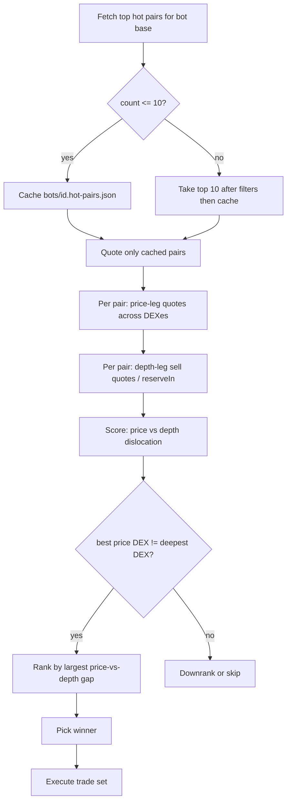

# Liquidity Bot V2 — Product & Redesign Notes

This package (`liquidity-bot-v2/`) implements the redesign below. **V1 remains in `../liquidity-bot/`.**

Living doc for how the bot was built, what broke, and the product direction: **hot-pair–bounded scanning + price/depth split legs**.

Related: [`../docs/LIQUIDITY_BOT_DESIGN.md`](../docs/LIQUIDITY_BOT_DESIGN.md), [`README.md`](./README.md), [`../BOTS.md`](../BOTS.md).

---

## 1. Product goal

Drive **liquidity through DecaStream** by trading regularly on cross-DEX dislocations — not only when a static arb threshold fires.

Primary KPI: **throughput of capital through Core / StreamDaemon** (paired place + settle), not pure arb PnL. Many viable picks have slightly negative quoted round-trip at small size; that is acceptable if volume keeps moving.

---

## 2. How we got here (process history)

### Phase A — Scaffold & dual legs

- Bot owns **placement only**: leg1 (often direct swap onto a thin venue) + leg2 `Core.placeTrade` into DecaStream.
- Settlement / streaming remains **local-monitor** (and protocol StreamDaemon), not the bot process.
- Config-driven bots (`bots/<id>.json`), Telegram ops, PM2 on EC2 (alpha, peers).

### Phase B — Universe + coupled selection

- Pair universe from static JSON: `config/{weth,usdc,…}_pairs_clean.json` (~90–99 WETH alts).
- Quoting: UniV2 / Sushi `getAmountsOut`, UniV3 QuoterV2 — across `STREAM_DEX_IDS` (v2 + 4 fee tiers + sushi).
- Evolved from “max forward spread” to **coupled** edges:
  - thin **buy** vs deep book
  - sell sized to thin-buy out on **deepest sell `reserveIn`** (matches StreamDaemon when `usePriceBased: false`)
  - metric: `coupledSpreadBps` (round-trip)
- Selection: `mid_range_spread` — p25–p75 band on coupled, pick best in band; safety filters (`maxSpreadBps`, `maxSellReserveUsageBps`, `minLiquidityRatio`); repeat guards / cooldowns.
- Live mode sizes from wallet balances; discover mode scans full configured universe at `nominalTradeUsd`.

### Phase C — Ops durability

- Stuck-trade cancel / mid-threshold `executeTrades` backstop.
- Completion watcher (`eth_getLogs` on `TradeCompleted`) for Telegram, chunked for Alchemy free-tier (default **10-block** ranges).
- Liquify / gas refuel / Permit2 edges.
- Exclusions after incidents (e.g. LDO OOG / approve → `excludedTargets: ["ldo"]`).

### Phase D — RPC pressure & Multicall3

Peers hit provider rate limits. Scan path was thousands of sequential `eth_call`s (`batchMaxCount: 1` on the provider).

Shipped Multicall3 batching (live on alpha at commit series `244cbd9f` → `fe9747b5` + self-update `/pull`):

| Layer | Change |
|-------|--------|
| Client | `src/chain/multicall3.ts` — `aggregate3` + chunking |
| Quotes | `dexQuoteMulticall.ts` — pool lookup / reserves / quote rounds |
| Balances | batched `balanceOf` |
| Edges | `quoteManyOnDex` in opportunity detector |
| Prefetch | alt balances + reverse-quote dedupe |

**Outcome:** HTTP **request count** per discover scan dropped a lot on paper (~5k → ~650). **Compute units (CU)** stayed high because each multicall still does heavy on-chain work, and faster cycles can raise CU/hour. Fallback RPC and shared keys can amplify perceived throttling. Multicall did **not** change the universe size: we still quote ~the whole roster each cycle.

---

## 3. Problems & issues faced

| Issue | What happened | Mitigation / status |
|-------|----------------|---------------------|
| RPC rate limits | Full-universe scan every cycle; CU-heavy multicalls; shared provider keys; optional FallbackProvider retry fan-out | Multicall shipped; **not enough** — need smaller universe / cadence (this redesign) |
| Wrong scarce resource | Tests/estimates counted HTTP calls; providers bill CU | Measure CU in dashboard; instrument per-cycle call counters |
| `eth_getLogs` catch-up | Completion watcher / monitor bootstrap can spam getLogs if cursor stuck; **not** used for quotes | Chunking, reconcile vanished trades; unrelated to quote CU |
| Stuck open trades | `maxOpenTrades: 1` + monitor lag blocks new placements | Stuck cancel / execute backstop; docs in `STUCK_TRADES_AND_MONITOR.md` |
| Capital deadlock | No base + stranded alts + skip-recent / repeat guards | Liquify sweep, reverse paths when alt held |
| LDO / heavy alts | Leg2 OOG / approve failures | `excludedTargets` |
| Selection vs economics | Forward-only “big arb” often terrible coupled | Mid-range coupled; liquidity > PnL |
| Hot pairs unused by bot | Product/frontend already ranks “hot” pairs; bot ignored them and scanned static JSON | **Next:** wire hot pairs as the scan set (below) |

---

## 4. Current scan loop (why so many calls)

Each cycle (alpha `scan.intervalMs` ≈ **25 min**, not 15; pair cooldown after fill is 15 min):

1. CoinGecko price cache (HTTP).
2. Multicall base (+ live alt) balances.
3. For **each** pair in the active set (~80–99 after skips): `quotePair` ≈ **3 multicall eth_calls** (factory/pool → state → quote), both directions when reverse applies.
4. Edge pass: deepest sell reserves + batched sell/buy quotes per candidate.
5. Finalist refresh: re-quote top `finalistCount` (e.g. 5).
6. Optionally completion watcher getLogs if open ledger rows exist.

**Efficiency today:** Multicall is efficient *per pair*. The inefficiency is **cardinalty** — O(universe × DEXes × rounds) every cycle when most pairs will never be traded. Caching factory addresses helps little while we still re-quote the whole book every run.

Quotes are **contract state** (`eth_call`), not block-range log scans.

---

## 5. Hot pairs — how they are generated & where we will read them

The ecosystem already has a **hot pairs** pipeline. The liquidity-bot **does not consume it yet**.

### Generation (keeper)

1. Keeper analysis (`keeper/src/tests/liquidity-analysis.ts` and related services) evaluates pairs on-chain: reserve depths, slippage savings vs deep/thin venues, etc.
2. Results upsert into Prisma **`liquidityData`** via `keeper/src/services/database-service.ts` (fields such as `slippageSavings`, `reserveAtotaldepth`, `reserveBtotaldepth`, `marketCap`, DEX of deepest A, etc.).

Rough intent of the metric set:

- **Depth** — where DecaStream-style reserve routing is meaningful.
- **`slippageSavings` / `%` savings** — estimated edge from routing via the protocol vs naive deep book (the frontend’s preferred “hot” signal).

Refresh cadence is driven by the keeper job that writes `liquidityData` (bot must treat rows as **eventually consistent**, not tick-by-tick).

### Serving (API)

Keeper HTTP API (`keeper/src/api/server.ts`):

| Endpoint | Use |
|----------|-----|
| `GET /api/tokens/top?metric=slippageSavings&limit=10` | Top hot pairs for bot intake (recommended default metric) |
| Same with `reserveAtotaldepth` / `marketCap` | Alternate rankings |
| `GET /api/tokens/:address/pairs`, `/api/pairs/...` | Deeper pair detail if needed |

Frontend already reads this via `frontend/app/lib/hooks/hotpairs/useEnhancedTokens.ts` (Hot Pairs UI).

### Where the **bot** will read them

| Option | Pros | Cons |
|--------|------|------|
| **A. HTTP → keeper `GET /api/tokens/top`** (preferred v1) | Same source as product UI; no new store | Needs reachable keeper URL + auth/ops; cache on EC2 |
| **B. Shared JSON artifact** written by keeper / CI into `config/hot_pairs_<base>.json` | Offline-friendly; simple S3/git pull | Staler; extra publish step |
| **C. Direct DB** from bot | Lowest lag | Couples bot to Prisma/DB credentials — avoid |

**Decision for redesign:** **Option A**, with a local disk cache (Option B as fallback file) so a down API does not enlarge the universe.

Per bot:

```text
HOT_PAIRS_API_URL  →  e.g. https://<keeper-host>/api/tokens/top
                     ?metric=slippageSavings&limit=10
                     (+ filter to bot.baseTokens, drop excludedTargets)
→ cache bots/<id>.hot-pairs.json when ≤ 10 rows
→ scan set = cached hot pairs only
```

If the API returns **more than 10**, take top 10 after base/exclude filters. If **≤ 10**, cache and use that list. If fetch fails, serve last good cache (do **not** fall back to full `*_pairs_clean.json` unless explicitly configured for emergency discover).

---

## 6. Proposed redesign — hot pairs + price/depth split

### 6.1 Intent

Massively cut RPC by **not scanning the whole ecosystem each run**, while still moving liquidity and aligning on-chain StreamDaemon selection with how DecaStream is meant to work:

- **Leg 1 (entry):** `usePriceBased: true` — StreamDaemon `findBestPriceForTokenPair` (best executable price).
- **Leg 2 (stream exit):** `usePriceBased: false` — `findHighestReservesForTokenPair` (deepest liquidity).

Off-chain selection should **prefer** pairs where **best price venue ≠ deepest reserve venue** (that dislocation is the product thesis).

### 6.2 Target process (each bot cycle)



1. **Load hot set** — up to **10** pairs from keeper top API (filtered to this bot’s `baseTokens`, `excludedTargets`, optional symbol denylist).
2. **Cache** — persist when the working set size is ≤ 10 (always after capping). TTL e.g. 1–6h or until next successful fetch; cycle can reuse cache without re-hitting API every run.
3. **Quote only the cache** — no full `*_pairs_clean.json` scan in steady state.
4. **Score dislocation (off-chain):**
   - Across stream DEXes, estimate **leg1 buy** as **price-based** (best `amountOut` / effective rate at size).
   - Estimate **leg2 sell** as **pool-depth-based** (max `reserveIn` venue, quote sell there).
   - Require **best-price DEX ≠ deepest-liquidity DEX** (configurable hard gate).
   - Rank by largest meaningful gap (bps between price-route implied rate and deep-route rate / coupled construction TBD in impl).
5. **Execute the winning trade set:**
   - Size from balances / `nominalTradeUsd` / `balanceUsagePct` as today.
   - **Leg 1:** `placeTrade` (or remaining direct path if we keep hybrid) with **`usePriceBased: true`** so on-chain routing matches the price thesis.
   - **Leg 2:** `placeTrade` with **`usePriceBased: false`** (deep book), `amountOutMin` clamp via existing buffer bps.
   - Keep safety: max spread, max sell reserve usage, stuck cancel, cooldowns, `maxOpenTrades`.

### 6.3 Config sketch (additive)

```jsonc
// bots/<id>.json — proposed
"scan": {
  "universeMode": "hot_pairs",       // "hot_pairs" | "static_json" (legacy)
  "hotPairsLimit": 10,
  "hotPairsMetric": "slippageSavings",
  "hotPairsCacheTtlMs": 3600000,
  "requirePriceNeDepth": true
},
"trade": {
  "usePriceBased": false,            // legacy single-flag — superseded by:
  "leg1UsePriceBased": true,
  "leg2UsePriceBased": false
}
```

Env: `HOT_PAIRS_API_BASE_URL` (or embed in bot deploy secrets).

### 6.4 What we stop doing in steady state

- Quoting ~100× pairs × 6 DEXes × multicall rounds every interval.
- Treating discover-mode full-universe as the production path.
- Forcing both legs onto reserve-based selection (`usePriceBased: false` everywhere).

### 6.5 What we keep

- Multicall for the **small** quote set.
- Mid-cycle safety filters (possibly recalibrated for price-vs-depth score).
- Monitor-owned settlement; completion notify; stuck-trade backstop.
- Static JSON retained as **ops discover** / soak tool (`scan:ecosystem`), not live loop default.

### 6.6 Implementation phases (suggested)

| Step | Work |
|------|------|
| P0 | Hot-pairs client + `bots/<id>.hot-pairs.json` cache; gate `collectQuotes` to ≤10 |
| P1 | Price-vs-depth scorer + `requirePriceNeDepth`; selection replaces mid-range over full universe |
| P2 | Per-leg `usePriceBased` on encode / `TradeExecutor` |
| P3 | Metrics: RPC/eth_call count per cycle, hot-cache age, skip reasons |
| P4 | Deprecate live full-universe; keep CLI discover for research |
| P5 | **Watch plane** — CEX WS + last DEX mids; Multicall only on gap / mid heartbeat (`watchMode`) |

### 6.7 Watch plane (P5 — shipped)

Steady-state cycles should spend **0 Quoter eth_calls** unless a trigger fires.

```
WATCH (always):  Binance bookTicker WS (REST fallback) + bots/<id>.dex-mids.json
TRIGGER:         |CEX_mid − DEX_mid| ≥ confirmGapBps  OR  DEX mid older than maxDexMidAgeMs
CONFIRM:         Multicall ≤ maxConfirmPairs (default 3), then size-sweep / execute as today
```

| Config | Default | Meaning |
|--------|---------|---------|
| `watchMode` | `prefer` | Idle = 0 quote RPC; `off` = quote warm/hot every cycle; `require` = skip if no CEX books |
| `maxConfirmPairs` | 3 | Cap confirms (gaps first, then missing/stale mids) |
| `maxCexStalenessMs` | 30s | Stale CEX print is not a trigger |
| `maxDexMidAgeMs` | 15 min | Heartbeat re-quote so mids do not rot |
| `confirmGapBps` | auto | Deca fee + minNet + 5 bps (override to fix) |

Dry-run prints `hot / cexListed / dexOnly / confirm`. Escape hatch: `npm run scan:dry-run -- --bot alpha --watch-off`.

CEX remains a **sensor** in V2 — no CEX orders. That handoff lives in `../arb-bot/NEW_DESIGN.md`.

---

## 7. Will this reduce RPC usage?

**Yes — substantially in steady state**, if we commit to hot-pairs-only quoting.

Rough intuition (order of magnitude, not a CU audit):

| | Today (WETH ~90 pairs) | Proposed (≤10 hot) |
|--|------------------------|---------------------|
| Pair quoting | ~90 × ~3 multicalls (+ edges) | ~10 × ~3 multicalls (+ edges) |
| Finalists | re-quote top 5 of large set | re-quote within 10 (maybe skip refresh) |
| Relative quote RPC | **baseline** | **~5–10× fewer** quote RPCs/cycle |

Caveats:

- Hot-pair **generation** still costs RPC/CU in the **keeper** job — that load moves off the bot cycle and can run on a different key/schedule.
- A bad cache refresh that accidentally widens the set undoes the win — hard-cap at 10 in code.
- Completion `getLogs` and monitor scans are unchanged; isolate those keys if they still thrash.
- Price-based on-chain paths may use different fetchers; off-chain quotes should mirror `findBestPrice` / `findHighestReserves` so we don’t add exploratory calls.

**Opinion:** This is the right next step. Multicall optimized the *shape* of calls; hot pairs + price/depth split optimizes *how many pairs we care about* and *why we trade them*. That is what will actually move the rate-limit needle for the live bot.

---

## 8. Open questions

1. Keeper URL + auth for alpha/peer EC2 (public API vs VPN vs signed fetch).
2. Exact score definition: coupled bps vs “price rate − deep rate” only on the hot set.
3. Keep mid-range band inside the 10, or always take max dislocation?
4. Reverse (alt→base) when wallet holds alt — still only within hot cache?
5. Emergency switch: `universeMode: "static_json"` for ops without redeploy.

---

## 9. Doc ownership

Update this file when universe mode, hot-pairs source, or leg `usePriceBased` flags ship. Keep `LIQUIDITY_BOT_DESIGN.md` for the legacy coupled / mid-range math until P4 retires it as the live default.
`)